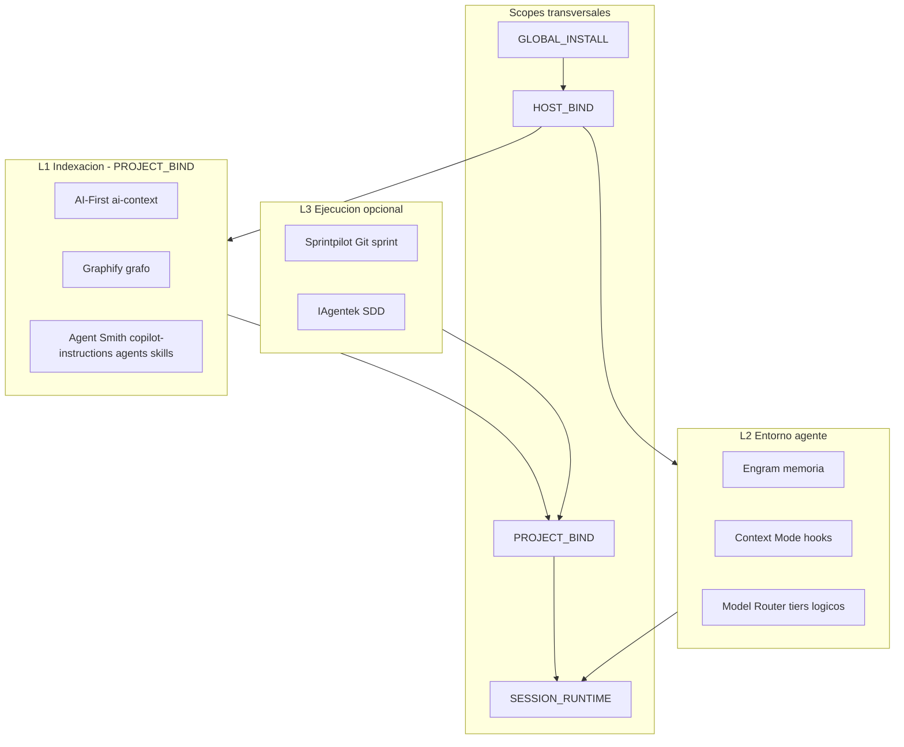

# Arquitectura de integración — AI Engineer Toolkit

**Versión:** 0.1.0-cursor  
**Fecha:** 31 mayo 2026  
**Base:** Manus + Gemini + investigación Cursor

## Visión

Un **toolkit de capas** que separa:

1. Qué se instala **una vez** en la máquina.
2. Qué se **vincula** por IDE y por repositorio.
3. Qué corre **en cada sesión** (MCP, hooks).

No es un monolito: son 8 herramientas upstream coordinadas por contratos y manifests.

## Diagrama de capas



## Las ocho herramientas y su rol

| Herramienta | Capa | Aportación |
|-------------|------|------------|
| AI-First | L1 | Contexto verificable `ai-context/` |
| Graphify | L1 | Grafo query-first |
| Agent Smith | L1 | Copilot/VS Code agents + instructions + handoffs |
| Engram | L2 | Memoria persistente SQLite FTS5 |
| Context Mode | L2 | Ahorro contexto + continuidad post-compact |
| OpenCode Model Router | L2 | Tiers @fast/@medium/@heavy (lógicos) |
| Sprintpilot | L3 | Sprint → PR automatizado |
| IAgentek | L3 | SDD + BMAD artefactos |

## Contrato central: Capability Profile

Los modelos **no** se hardcodean en `tiers.json`. Flujo:

1. `model_router_tiers.logical.json` — patrones de tarea y modos.
2. `capability_profile.yaml` — candidatos reales (Go, Zen, Copilot, etc.).
3. `discovery` al inicio de sesión — validar que candidatos existen.
4. Plugin router (OpenCode) — interpreta tiers → profile.

Ver [PROVIDER_CAPABILITY_MODEL.md](PROVIDER_CAPABILITY_MODEL.md).

## Contrato: Lifecycle idempotente

Ver [LIFECYCLE_IDEMPOTENCY.md](LIFECYCLE_IDEMPOTENCY.md) y [templates/toolkit.manifest.yaml](templates/toolkit.manifest.yaml).

**Regla de oro:** Fase 0/1 (global + host) se ejecutan raramente; Fase 2 (proyecto) es re-ejecutable con `skip-if-fresh`.

## Agent Smith en la arquitectura

Agent Smith es **L1** pero alimenta hosts Copilot-native:

- `.github/copilot-instructions.md` → VS Code + GitHub Copilot
- `.github/agents/*.agent.md` + `handoffs.json` → delegación
- `SKILL.md` → portable a Cursor/OpenCode/Sprintpilot

El `AGENTS.md` del toolkit **referencia** instructions, no duplica.

Ver [research/06_agentsmith_hosts.md](research/06_agentsmith_hosts.md).

## Runtime (resumen)

| Componente | Tiempo real | Segundo plano |
|------------|-------------|---------------|
| Context Mode hooks | Cada tool call / PreCompact | SQLite indexación |
| Engram MCP | On-demand mem_* | Proceso MCP hijo IDE |
| Graphify query | Bajo demanda | Build grafo en L1 |
| Model router | Cada mensaje OpenCode | Inyección prompt |

Detalle: [RUNTIME_TOPOLOGY.md](RUNTIME_TOPOLOGY.md).

## Hosts de referencia

**Primarios:** Cursor + OpenCode (Go, Zen, Copilot Student).  
**Matriz completa:** [research/04_host_matrix.md](research/04_host_matrix.md).

## Estructura en el proyecto destino

```
<repo>/
├── AGENTS.md                      # Toolkit — leer primero
├── .github/
│   ├── copilot-instructions.md    # Agent Smith (si L1 corrió)
│   ├── agents/*.agent.md
│   └── copilot/handoffs.json
├── ai-context/                    # AI-First
├── graphify-out/                  # Graphify
├── .engram/                       # Engram data (opcional path)
├── .ai_engineer_toolkit/
│   ├── capability_profile.yaml
│   ├── model_router_tiers.logical.json
│   ├── mcp.manifest.json
│   └── README.md
└── opencode.json                  # MCP + providers (si OpenCode)
```

## Flujo brownfield

Ver [INTEGRATION_SEQUENCE.md](INTEGRATION_SEQUENCE.md).

## Documentos relacionados

- [INVESTIGATION_REPORT.md](INVESTIGATION_REPORT.md) — informe completo
- [research/](research/) — fichas por herramienta
- [profiles/](profiles/) — perfiles de capacidad ejemplo
- [specs/doctor.spec.md](specs/doctor.spec.md) — verificación futura
