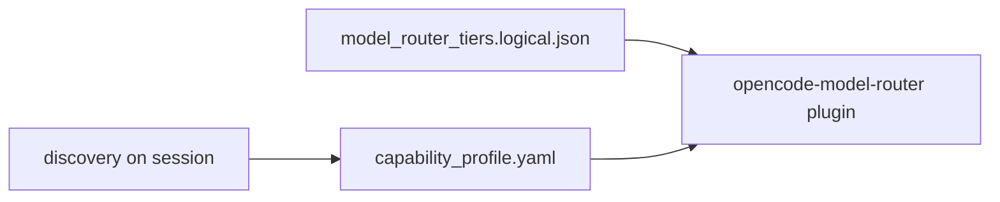

# Modelo de capacidades de proveedores (agnóstico)

## Problema

[`foundational_docs/manus/model_router_tiers.json`](../../manus/model_router_tiers.json) asume:

```json
"fast": {"model": "anthropic/claude-haiku-4-5"}
```

Muchos usuarios **no** tienen API Anthropic directa. Ejemplo real:

- OpenCode + **Go** (suscripción generosa)
- OpenCode **Zen** (créditos, modelos potentes)
- **GitHub Copilot Student** (picker limitado)
- Cursor con modelo propio

## Solución: tres niveles de configuración



### 1. Tiers lógicos (`@fast`, `@medium`, `@heavy`)

Solo definen:

- Patrones de tarea (`search/grep` → fast).
- Modos (`budget`, `normal`, `quality`, `deep`).
- Ratios de coste relativos (1x, 5x, 20x).

**Sin** IDs de modelo.

Plantilla: [templates/model_router_tiers.logical.json](templates/model_router_tiers.logical.json).

### 2. Capability profile (por usuario o máquina)

Mapea tier → lista ordenada de candidatos `{provider, model}`.

Ejemplo canónico: [profiles/opencode-go-zen-copilot-student.yaml](profiles/opencode-go-zen-copilot-student.yaml).

Schema: [templates/capability_profile.schema.json](templates/capability_profile.schema.json).

### 3. Discovery

Al inicio de sesión (o `doctor --runtime`):

- OpenCode: listar modelos conectados (`/models`, `opencode.json`).
- Copilot: modelos visibles + BYOK extension.
- Cursor: modelo seleccionado en UI.

Si un candidato no existe → `fallback.on_model_missing: next_candidate`.

## Políticas de presupuesto

| policy_id | Comportamiento |
|-----------|----------------|
| `student_plus_go` | Default Go flash; Zen solo heavy+confirm |
| `zen_unlimited` | Zen permitido en medium/heavy (créditos) |
| `copilot_only` | Tiers mapeados a picker Copilot |
| `multi_host` | OpenCode para código; Copilot para chat IDE |

## OpenCode Go vs Zen (decisión de tier)

| Tier | Go (recomendado) | Zen (cuando) |
|------|------------------|--------------|
| fast | deepseek-v4-flash, minimax-m2.5 | Raramente |
| medium | kimi-k2.6, deepseek-v4-pro | Si Go falla calidad |
| heavy | deepseek-v4-pro | Arquitectura larga; confirmar créditos |

Go puede usar balance Zen tras agotar ventana 5h (config consola OpenCode).

## Copilot Student

- No usar como reemplazo del router OpenCode en terminal.
- Rol: IDE chat, revisión rápida, cuando cuota Student lo permita.
- Agent Smith + `copilot-instructions.md` maximizan valor sin modelos premium.

## Hosts desconocidos

Plantilla vacía: [profiles/template-capability-profile.yaml](profiles/template-capability-profile.yaml) (crear si falta).

Instrucción al usuario: rellenar candidatos tras primer `doctor --runtime`.

## Integración con plugin opencode-model-router

1. Copiar `model_router_tiers.logical.json` → proyecto `.ai_engineer_toolkit/`.
2. Symlink o merge con `tiers.json` del plugin según docs del plugin.
3. Documentar en `opencode.json` que `model` default viene del profile, no de preset anthropic.

## Validación

```text
doctor --runtime:
  - cada tier tiene ≥1 candidato resoluble
  - mode budget no apunta a zen sin flag
  - heavy requiere confirm si policy lo exige
```
