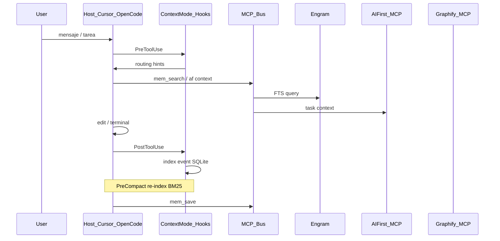

# Topología de runtime: foreground, background y hooks

## Modelo de procesos

## Quién arranca qué

| Proceso | Iniciador | Cuándo | Duración |
|---------|-----------|--------|----------|
| `engram mcp` | IDE (stdio) | Abrir proyecto / sesión agente | Hasta cerrar IDE |
| `af mcp` | IDE | Config MCP | Sesión |
| `graphify mcp` | IDE (opcional) | Si habilitado | Sesión |
| Context Mode hooks | IDE plugin | Cada turno | Sesión |
| `graphify .` | Usuario / init Fase 2 | L1 bind | Batch, termina |
| `agentsmith assimilate` | Usuario / init Fase 2 | L1 bind | Batch (usa Copilot SDK) |
| `autopilot.js` | Usuario L3 | Sprint | Hasta fin sprint |

**Anti-patrón:** `engram mcp &` en script de init del repo.

## Engram — ciclo de memoria

1. Trabajo significativo → `mem_save` (What/Why/Where/Learned).
2. Persistencia SQLite + FTS5 en `ENGRAM_DATA_DIR`.
3. Nueva sesión → `mem_session_start` → `mem_search` / `mem_context`.
4. PreCompact (Context Mode) no reemplaza Engram; son complementarios.

Tras upgrade del binario: `engram setup <host>` + reiniciar IDE.

## Context Mode — hooks

| Hook | Rol |
|------|-----|
| PreToolUse | Instrucciones routing; evitar volcar datos crudos |
| PostToolUse | Indexar evento |
| PreCompact | Recuperar contexto relevante vía BM25 |
| SessionStart | Restaurar continuidad |

Herramientas MCP: `ctx_execute`, `ctx_search`, `ctx_insight`, etc.

## AI-First en sesión

- Agente pide `af context --task` vía MCP o lee `agent_brief.md`.
- `context_manifest.json` — verificar frescura antes de confiar.

## Graphify en sesión

- Patrón **query-first**: consultar grafo antes de `read` masivo.
- Build del grafo es L1 (batch), no cada mensaje.

## Model Router (OpenCode)

- **Foreground:** cada mensaje del orquestador evalúa tier.
- **Background:** ninguno (solo inyección en prompt).
- Depende de `capability_profile.yaml` resoluble.

## Conflictos y mitigaciones

| Conflicto | Mitigación |
|-----------|------------|
| Muchos MCP → RAM/latencia | `mcp.manifest.json` → `minimal_viable` |
| Engram + Context Mode SQLite | Rutas separadas (`~/.engram` vs ctx DB) |
| Copilot Student sin modelo heavy | Profile: heavy → Go Pro primero, Zen confirmado |
| Agent Smith requiere Copilot SDK | Degradar L1 AS si no hay suscripción |
| Compactación borra chat | Context Mode + Engram recuperan |

## Health checks (doctor --runtime)

- MCP responde (stdio ping o herramienta ligera).
- `mem_stats` OK.
- `af doctor context` OK si ai-context existe.
- Candidatos en capability_profile existen en `/models`.

Ver [specs/doctor.spec.md](specs/doctor.spec.md).
